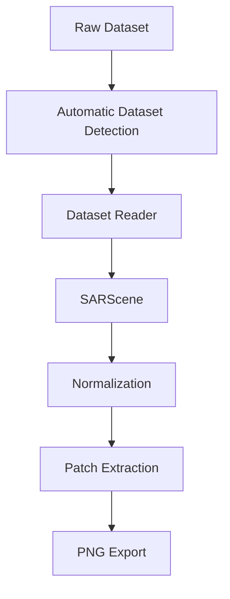

# SAR Preprocessor

**A unified, dataset-agnostic preprocessing framework for Synthetic Aperture Radar (SAR) imagery.**

> **Status**
>
> This project is under active development.
> APIs may evolve as additional SAR datasets and preprocessing strategies are added.

SAR Preprocessor automatically detects the format of a raw SAR dataset and converts it into a common, model-ready patch dataset — without requiring the user to specify which sensor or dataset the data came from.

[](#)
[](#)
[](#)

---

## Table of Contents

- [Project Overview](#project-overview)
- [Key Features](#key-features)
- [Why This Project Exists](#why-this-project-exists)
- [Supported Datasets](#supported-datasets)
- [Detection Strategy](#detection-strategy)
- [Architecture](#architecture)
- [Directory Structure](#directory-structure)
- [Installation](#installation)
- [Requirements](#requirements)
- [Quick Start](#quick-start)
- [Command Line Examples](#command-line-examples)
- [Expected Dataset Directory Layout](#expected-dataset-directory-layout)
- [Expected Output Directory Layout](#expected-output-directory-layout)
- [Processing Pipeline](#processing-pipeline)
- [Module Descriptions](#module-descriptions)
- [The SARScene Abstraction](#the-sarscene-abstraction)
- [Dataset Detection Priority](#dataset-detection-priority)
- [Adding a New Dataset Reader](#adding-a-new-dataset-reader)
- [Error Handling](#error-handling)
- [Performance Considerations](#performance-considerations)
- [Memory Usage](#memory-usage)
- [Extensibility](#extensibility)
- [Roadmap](#roadmap)
- [Contributing](#contributing)
- [Testing](#testing)
- [License](#license)
- [Citation](#citation)
- [Acknowledgements](#acknowledgements)
- [FAQ](#faq)
- [Future Work](#future-work)

---

## Project Overview

SAR Preprocessor is a standalone preprocessing framework for Synthetic Aperture Radar data. It is **not** a model, a training framework, or a despeckling algorithm. Its sole responsibility is to take heterogeneous, sensor-specific SAR products and reduce them to a single, consistent, model-ready representation: normalized PNG patches organized into `train` / `val` / `test` splits.

Different SAR sources — satellite, airborne, and pre-packaged benchmark datasets — ship in incompatible formats, resolutions, and metadata conventions. SAR Preprocessor abstracts these differences behind a single `SARScene` interface, so that everything downstream of ingestion (normalization, patch extraction, export) is written once and shared across all supported datasets.

The user only provides an input path and an output path. The dataset type is inferred automatically.

## Key Features

- **Automatic dataset detection** — no `--dataset-type` flag, no configuration file.
- **Unified internal representation** (`SARScene`) decouples format-specific parsing from the rest of the pipeline.
- **Modular reader architecture** — each supported dataset is implemented as an isolated reader exposing `detect()` and `read()`.
- **Deterministic, dataset-independent pipeline** — normalization, patch extraction, and export behave identically regardless of the source sensor.
- **Preserved provenance** — sensor and acquisition metadata are retained internally during processing, even though final exports are flat PNG patches.
- **Split-aware output** — produces `train/val/test` directory layouts ready for standard PyTorch/TensorFlow data loaders.

## Why This Project Exists

Working with SAR data across multiple sources typically means writing bespoke parsing code for every dataset, every time a new project starts. SAR Preprocessor exists to remove that repeated cost: implement a reader once, and every dataset that reader supports becomes usable by any downstream pipeline that consumes the standard patch-dataset format. This is especially valuable for despeckling, super-resolution, change detection, and generative modeling work, where the modeling code should not need to know whether its input patches originated from Sentinel-1 or UAVSAR.

## Supported Datasets

| Dataset | Provider | Product Type | Detection Signal |
|---|---|---|---|
| Sentinel-1 | ESA / Copernicus | GRD, `.SAFE` product | `manifest.safe` inside a `.SAFE` directory |
| UAVSAR | NASA / JPL | Airborne polarimetric SAR | Paired `.ann` (annotation) and `.grd` (data) files |
| AIRSAR | NASA / JPL | Airborne polarimetric SAR | AIRSAR-specific metadata and file layout |
| DSIFN | Benchmark dataset | Pre-split imagery dataset | Presence of `train/`, `val/`, `test/` subdirectories |

> **Note:** SAR Preprocessor does not bundle, host, or redistribute any of these datasets. Users are responsible for downloading each dataset from its official source and complying with the corresponding license terms.

## Detection Strategy

Detection is performed by probing the input path against each registered reader's `detect(path)` method, in priority order. The first reader that returns a positive match is used to `read()` the dataset. This avoids ambiguity between formats that might otherwise share superficial similarities (e.g., generic directory names or common image extensions).

If no registered reader matches the input path, the pipeline exits with a descriptive error rather than guessing or falling back to a default parser.

## Architecture



Each stage after `SARScene` is dataset-independent. A dataset reader's only responsibility is producing a valid `SARScene`; everything downstream is shared, tested once, and reused across every supported sensor.

## Directory Structure

```
sar_preprocessor/
├── __init__.py
├── scene.py            # SARScene definition
├── build_dataset.py     # CLI entry point / pipeline orchestration
├── normalize.py         # Intensity normalization
├── patchify.py          # Patch extraction logic
├── export.py             # PNG export
├── utils.py              # Shared helpers
└── readers/
    ├── sentinel1.py
    ├── uavsar.py
    ├── airsar.py
    └── dsifn.py
```

## Installation

```bash
git clone https://github.com/<org>/sar-preprocessor.git
cd sar-preprocessor
pip install -e .
```

<details>
<summary>Installing in a virtual environment (recommended)</summary>

```bash
python -m venv .venv
source .venv/bin/activate   # Windows: .venv\Scripts\activate
pip install -e .
```
</details>

## Requirements

- Python 3.9+
- NumPy
- Pillow
- rasterio or GDAL bindings (for reading GeoTIFF / SAFE products)

> **Warning:** GDAL/rasterio installation can be platform-dependent. Refer to the [rasterio installation guide](https://rasterio.readthedocs.io/en/stable/installation.html) if you encounter build errors.

## Quick Start

```bash
python -m sar_preprocessor.build_dataset \
    --input datasets/Sentinel1/S1A_IW_GRDH_1SDV_20230715T051203.SAFE \
    --output processed_dataset/
```

No dataset type flag is required — the reader is selected automatically based on the contents of `--input`.

## Command Line Examples

```bash
# Sentinel-1 SAFE product
python -m sar_preprocessor.build_dataset \
    --input datasets/Sentinel1/S1A_IW_GRDH_1SDV_20230715T051203.SAFE \
    --output processed_dataset/

# UAVSAR directory (ann + grd pairs)
python -m sar_preprocessor.build_dataset \
    --input datasets/UAVSAR \
    --output processed_dataset/

# AIRSAR mission directory
python -m sar_preprocessor.build_dataset \
    --input datasets/AIRSAR/mission_001 \
    --output processed_dataset/

# DSIFN pre-split dataset
python -m sar_preprocessor.build_dataset \
    --input datasets/DSIFN \
    --output processed_dataset/
```

## Expected Dataset Directory Layout

```
datasets/
│
├── Sentinel1/
│   ├── S1A_IW_GRDH_1SDV_20230715T051203.SAFE/
│   └── S1A_IW_GRDH_1SDV_20230716T051203.SAFE/
│
├── UAVSAR/
│   └── scene_001/
│       ├── scene_001.ann
│       └── scene_001.grd
│
├── AIRSAR/
│   └── mission_001/
│
└── DSIFN/
    ├── train/
    ├── val/
    └── test/
```

## Expected Output Directory Layout

```
processed_dataset/
│
├── train/
│   ├── 000001.png
│   └── 000002.png
│
├── val/
│   └── ...
│
└── test/
    └── ...
```

Each exported PNG is a normalized SAR patch. Original sensor and acquisition metadata are retained internally during processing but are not written alongside the exported patch files.

## Processing Pipeline

1. **Detection** — the input path is probed against each registered reader.
2. **Reading** — the matched reader parses the dataset into a `SARScene`.
3. **Normalization** — intensity values are rescaled to a consistent range.
4. **Patch extraction** — the scene is tiled into fixed-size patches.
5. **Export** — patches are written as PNG files into the split-aware output directory.

This sequence is identical for every supported dataset; only the reader stage changes.

## Module Descriptions

| Module | Responsibility |
|---|---|
| `scene.py` | Defines the `SARScene` data structure shared by all readers |
| `build_dataset.py` | CLI entry point; orchestrates detection, reading, and the pipeline |
| `normalize.py` | Converts raw intensity/amplitude values into a normalized range |
| `patchify.py` | Extracts fixed-size patches from a normalized scene |
| `export.py` | Writes patches to disk as PNG files, organized by split |
| `utils.py` | Shared I/O and path-handling helpers |
| `readers/*.py` | Dataset-specific `detect()` / `read()` implementations |

## The SARScene Abstraction

`SARScene` is the single data structure that every reader produces and every downstream stage consumes. It decouples dataset-specific parsing from generic processing: normalization, patch extraction, and export code never need to know which sensor produced the data, only that it conforms to the `SARScene` interface.

```python
scene = reader.read(path)
# scene now exposes a normalized array of SAR intensity/amplitude data
# plus internally retained sensor and acquisition metadata
```

Because every reader targets the same output type, adding a new dataset never requires modifying `normalize.py`, `patchify.py`, or `export.py`.

## Dataset Detection Priority

When multiple readers could plausibly match ambiguous input, detection is evaluated in a fixed priority order:

1. Sentinel-1
2. DSIFN
3. UAVSAR
4. AIRSAR

The first reader whose `detect(path)` returns a positive match is used. If none match, the pipeline exits with an informative error rather than proceeding with an incorrect reader.

## Adding a New Dataset Reader

1. Create a new file in `sar_preprocessor/readers/`, e.g. `mynewdataset.py`.
2. Implement two functions:

```python
def detect(path: str) -> bool:
    """Return True if `path` matches this dataset's format."""
    ...

def read(path: str) -> SARScene:
    """Parse `path` and return a populated SARScene."""
    ...
```

3. Register the reader in the detection priority list.
4. No changes are required to `normalize.py`, `patchify.py`, or `export.py`.

<details>
<summary>Guidelines for a good reader implementation</summary>

- Keep `detect()` cheap — it should not fully parse the dataset, only check for identifying markers (file extensions, directory structure, header signatures).
- Keep dataset-specific quirks contained within the reader; do not leak sensor-specific assumptions into shared modules.
- Populate `SARScene` metadata fields even if downstream stages do not currently use them — this preserves provenance for future use.

</details>

## Error Handling

- If no reader matches the input path, the pipeline exits with a message indicating that dataset detection failed and which paths were probed.
- If a matched reader fails to parse the dataset (e.g., a corrupted or incomplete product), the error is raised with the originating file path to aid debugging.
- Output directories are validated before processing begins to avoid partial writes on invalid paths.

## Performance Considerations

- Patch extraction and export are the dominant cost for large scenes; processing time scales with input scene resolution and patch count.
- Reading is I/O-bound for large satellite products (e.g., Sentinel-1 GRD); local SSD storage is recommended over network-mounted datasets.

## Memory Usage

- Full scenes are loaded into memory during normalization and patch extraction. Very large scenes (e.g., full-swath Sentinel-1 GRD products) may require substantial available RAM.
- Processing datasets in smaller batches, or cropping scenes prior to ingestion, can reduce peak memory usage.

## Extensibility

The reader-based architecture is the primary extension point. Any data source that can be reduced to a `SARScene` — regardless of sensor, polarization, or file format — can be integrated without modifying the shared pipeline stages.

## Roadmap

- [ ] Configurable patch size and stride via CLI flags
- [ ] Optional multi-polarization export
- [ ] Parallelized patch extraction for large scenes
- [ ] Additional dataset readers (community contributions welcome)

## Contributing

Contributions are welcome, particularly new dataset readers. Please:

1. Open an issue describing the dataset and its format before submitting a reader.
2. Follow the existing `detect()` / `read()` interface.
3. Include a minimal test fixture where possible (synthetic or redistributable sample data only — no proprietary or license-restricted datasets).
4. Submit a pull request with a clear description of the changes.

## Testing

```bash
pip install -e ".[dev]"
pytest tests/
```

> **Note:** Dataset-specific reader tests require small sample fixtures. Do not commit full-size proprietary datasets to the repository.

## License

This project is distributed under the MIT License. See [`LICENSE`](LICENSE) for details.

Datasets processed by this tool are **not** covered by this license. Each dataset (Sentinel-1, UAVSAR, AIRSAR, DSIFN) is distributed under its own respective license and usage terms. Users are responsible for downloading datasets from their official sources and complying with the corresponding agreements.

## Citation

If you use SAR Preprocessor in academic work, please cite this repository:

```bibtex
@software{sar_preprocessor,
  title  = {SAR Preprocessor: A Unified Preprocessing Framework for Multi-Sensor SAR Data},
  author = {<author name>},
  year   = {<year>},
  url    = {https://github.com/<org>/sar-preprocessor}
}
```

## Acknowledgements

This project builds on publicly documented formats and specifications for Sentinel-1 (ESA/Copernicus), UAVSAR and AIRSAR (NASA/JPL), and the DSIFN benchmark dataset. Thanks to the maintainers of these programs for their open documentation.

## FAQ

<details>
<summary>Do I need to tell the tool which dataset I'm using?</summary>

No. Dataset type is detected automatically from the contents of the input path.
</details>

<details>
<summary>Does this package include or download the datasets?</summary>

No. SAR Preprocessor only processes datasets that the user has already downloaded from their official sources.
</details>

<details>
<summary>What format are the final outputs?</summary>

Normalized PNG patches, organized into `train`, `val`, and `test` subdirectories.
</details>

<details>
<summary>Is dataset metadata preserved?</summary>

Sensor and acquisition metadata are preserved internally during processing, but exported patch files are flat PNGs and do not carry embedded metadata.
</details>

<details>
<summary>Can I add support for a dataset that isn't listed?</summary>

Yes — see [Adding a New Dataset Reader](#adding-a-new-dataset-reader).
</details>

## Future Work

- Support for additional SAR products and airborne sensors
- Optional export formats beyond PNG (e.g., GeoTIFF patches with retained metadata)
- Configurable normalization strategies per dataset
